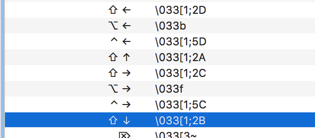

# Jack's Dotfiles

My dotfiles for Vim and ZSH. Shamelessly stolen from tonnes of dotfile repositories I found online.

Files are symlinked into the proper location, and have the `.` added. For example:

```
~/dotfiles/vim/vim => ~/.vim
~/dotfiles/vim/vimrc => ~/.vimrc
~/dotfiles/zsh/zshrc => ~/.zshrc
~/dotfiles/git/gitignore_global => ~/.gitignore_global
...and so on
```
# Installing

- Swap your shell to ZSH (System Prefs -> Users -> Right Click on 'Advanced Settings' -> select ZSH from dropdown).
- (if new MacBook)
    - generate ssh key `ssh-keygen -t rsa -b 4096 -C "jack@jackfranklin.net"`
    - add that ssh key to github profile
    - install homebrew: /usr/bin/ruby -e "$(curl -fsSL https://raw.githubusercontent.com/Homebrew/install/master/install)"
- Clone repository into `~/dotfiles`
- `cd ~/dotfiles`
- Go through the `Makefile` and run the commands to get the things up that you'd like.

# Order of Makefile

The best order to run things is:

- `symlinks`
- `install_brews`
- `antigen`
- `nvm`
- `python_modules`
- `ruby`
- `install-global-npms`

# Ctrl-H in Neovim

If Ctrl-H doesn't work as expected in Neovim, you can run `make fix_neovim_ctrl_h`.

# Vim Plugins

Are all handled with Vim Plug.

# Setting up Terminal.app

- Install the `Chalk.terminal` theme.
- Install [Input Mono](http://input.fontbureau.com/preview/)
- Configure Shift+UP and Shift+DOWN to send the right sequence (such that you can use shift + arrow keys to resize Tmux splits.



# Setting up the ergodox keyboards

- Install [Karabiner Elements](https://github.com/tekezo/Karabiner-Elements/)
- Map SHIFT+F13 to `(` and SHIFT+F14 to `)` to get the brackets working on the keyboard
- Also configure the other FN keys to work correctly as media play/pause and volume up/down

# Mac Apps

Most should be installed with the Brewfile, which you can install with `make install_brews`

# Authentication

- `npm adduser` to login to npm
- Generate a new token for Github and use that to authenticate with `hub`

